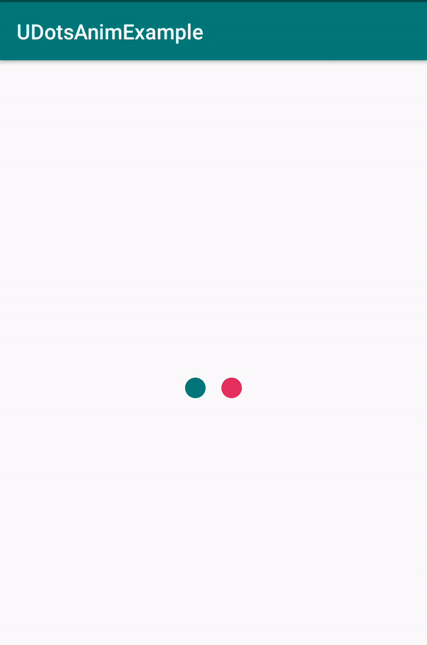
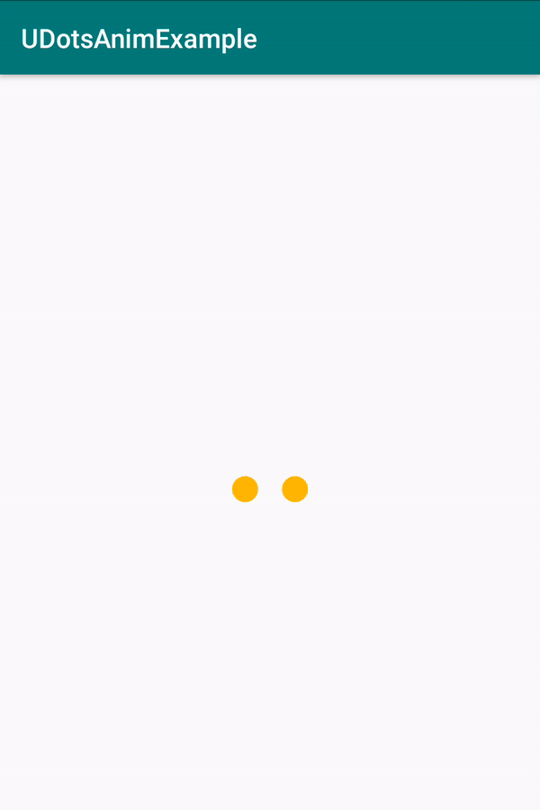
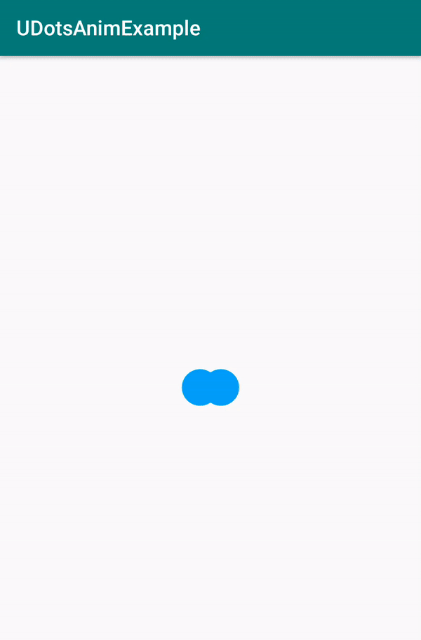

## UDotsAnim

UDotsAnim is a new kind of activity indicator with some awesome animations. Try this new Loader in your projects and enhance the UI experience.

### Different colors of dots


### Switching different colors


### Speed Up animation


### Bigger size of dots


## Example

To run the example project, clone the repo, and run the project in android studio.

## Usage

Do the following simple steps to make an awesome [UDotsAnim](https://github.com/umair-developer/UDotsAnim)

First of all,

Add the maven in your project level build.gradle

```
allprojects {
    repositories {
        maven { url "https://jitpack.io"}
    }
}
```


Add the dependency in your app level build.gradle

```
dependencies {
	        implementation 'com.github.umair-developer:UDotsAnim:0.1.0'
	}
```


Add the UDotsAnim in your XML and enjoy.

```
<com.uproxone.dotloader.UDotsAnim
        android:layout_width="wrap_content"
        android:layout_height="wrap_content"
        android:layout_centerInParent="true"
        app:dot_radius="10dp"
        app:color_switch_duration="5"
        app:dots_animation_duration="1000"
        app:left_dot_color="@color/colorPrimary"
        app:right_dot_color="@color/colorAccent"
        app:stop_after_duration="5000"
        app:color_array="@array/dot_colors"/>
```

### Change Properties

You can adjust UDotsAnim at your own will. Like

Set the radius as you want. The default value is 0.

``` app:dot_radius="10dp" ```


Set the color switching duration in milli seconds as you want. The default value is 80 ms.

``` app:color_switch_duration="100" ```


Set the dots animation duration in milli seconds as you want. The default value is 1000 ms.

``` app:dots_animation_duration="800" ```


Set left dot color as you want. The default color is GRAY.

``` app:left_dot_color="@color/colorPrimary" ```


Set right dot color as you want. The default color is DKGRAY.

``` app:right_dot_color="@color/colorAccent" ```


Set stop animation after a specific time. The default value is none.

``` app:stop_after_duration="5000" ```


Pass the array of colors to swhitch the color after specific time. The default value is none.

``` app:color_array="@array/dot_colors" ```

You can store this array in Res > value > color.xml Like

``` 
<array name="dot_colors">
        <item>#222222</item>
        <item>#03A9F4</item>
        <item>#E65100</item>
        <item>#FFBB00</item>
        <item>#555555</item>
        <item>#327470</item>
        <item>#60ceca</item>
        <item>#dba102</item>
    </array>
 ```

That's it... :-)

## Contributions

Your contributions are most welcomed. Do let me know if you find any kind of issue while using this file. Please open an issue to discuss that problem. Thanks

## Auther

Muhammad Umair, umair2592@gmail.com

## License

[MIT](https://github.com/umair-developer/UDotsAnim/blob/master/LICENSE)
